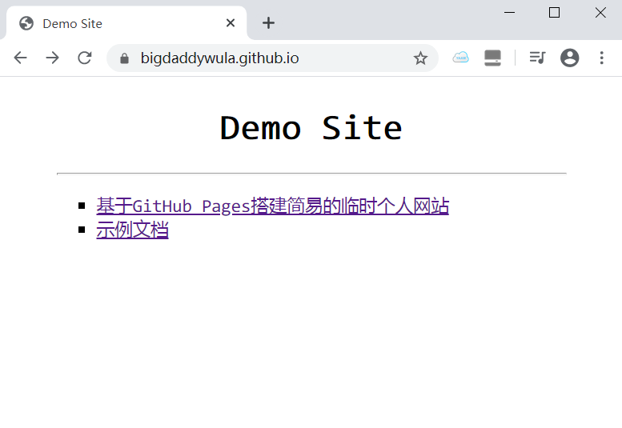
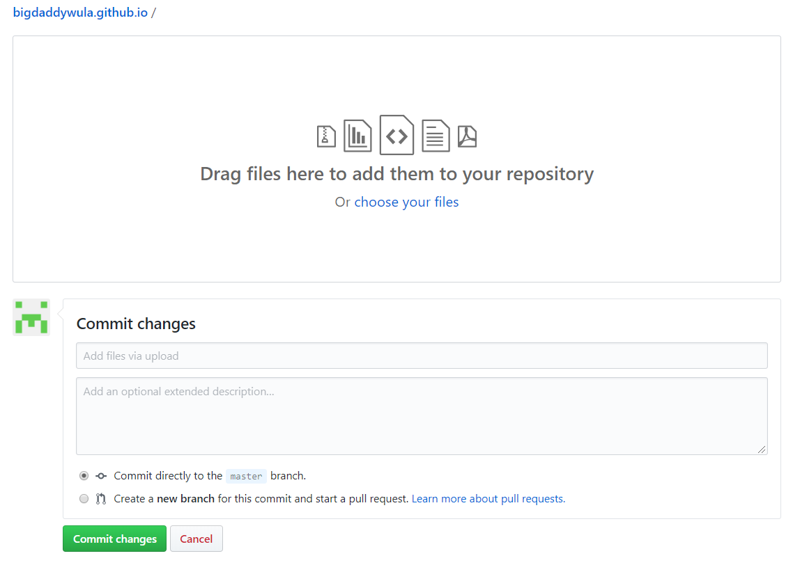

# 基于GitHub Pages搭建简易的临时个人网站

## 关于GitHub Pages

> GitHub Pages 是一项静态站点托管服务，它直接从 GitHub 上的仓库获取 HTML、CSS 和 JavaScript 文件，（可选）通过构建过程运行文件，然后发布网站。 您可以在 [GitHub Pages 示例集合](https://github.com/collections/github-pages-examples)中查看 GitHub Pages 站点的示例。

## 准备工作

### 必要的工具

- 一台电脑，以及能够访问[GitHub](https://github.com)的网络。
- 文本编辑器。虽然记事本已经足够，但是建议读者在下面列出的几个工具里选择（排名分先后）。不必恐慌：我们只需要用到代码高亮、自动补全等基本功能。
  - [Visual Studio Code](https://code.visualstudio.com/)
  - [SublimeText](http://www.sublimetext.com/)
  - [Notepad++](https://notepad-plus-plus.org/)
- 耐心和爱。

### 创建GitHub账号

### 创建个人GitHub Pages库

参见[Creating a GitHub Pages site](https://help.github.com/cn/github/working-with-github-pages/creating-a-github-pages-site)。

## <span id="homepage">创建主页</span>

> 确保你完成了上面的准备，再继续阅读。

接下来我们要创建一个主页，用来索引你上传的所有文章。读者可以在计算机上某个位置新建一个文件夹，命名为`my-website`（或者任何你喜欢的名字），下面所有的工作都在这个文件夹里进行。

在`my-website`目录下创建一个名为`index.html`的文件。写入如下内容：

```html
<!DOCTYPE html>
<html>
  <head>
    <meta charset=utf-8>
    <title><!--(注1)--></title>
  </head>
  <body>
    <h1><!--(注2)--></h1>
    <ul>
      <li><a href="<!--(注3.1)-->"><!--(注3.2)--></a></li>
      <li><a href="<!--(注3.1)-->"><!--(注3.2)--></a></li>
    </ul>
  </body>
</html>
```

这里对上面的代码做一点说明。

- 注0：代码中用`<!--` 和`-->`括起来的部分表示注释。当你按照下面的说明替换这部分代码的时候，记得要将它们一同删去。
- 注1：用你想要显示在浏览器标签栏里的标题替换这里的内容。例如，若你写`<title>Demo Site</title>`，那么浏览器标签栏就会显示：
<br><div style="text-align: center"></div>
<br>
- 注2：`<h1>`和`</h1>`标签包裹的内容表示一级标题。相应地有`<h2>`，`<h3>`，直到`<h6>`。本文就是一个使用多级标题组织内容的例子。
- 注3：3.1位置填写你上传的文章的链接（参见后文），3.2位置填写想要在这个页面显示的文字内容。例如，若你在3.1处填写`example.html`，在3.2处填写“示例文档”，那么页面效果为
<br><div style="text-align: center"></div>
<br>而当你点击“示例文档”这个链接时，它会转向``my-website/example.html`文件。

## 上传文章

终于！你可以上传自己的文章了。

> 首先，你要写出自己的文章。

### 将文章转换成HTML格式

在我们将要实现的这个简易的临时网站中，所有的文章都以HTML格式存储和展示。无论你采用什么工具写作，最终都要将你的文章转换成HTML格式。

#### 如果你使用Word写作

我相信相当大一部分人仍然在用Word作为主力写作工具，虽然它并不是那么适合。好消息是，将Word文档转换为HTML并不那么困难。

首先打开你的Word文档。依次点击“文件”->“另存为”->“浏览”，选择保存为“筛选过的HTML”，扩展名改为html，保存到你的`my-website`文件夹（或者它的子文件夹，见下）中，如下图。
<br><div style="text-align: center"></div>
<br><div style="text-align: center"></div>
<br>

点击保存会显示一个格式丢失的警告，选“是”。

这里笔者建议在你的`my-website`文件夹下建立一个新的文件夹（例如，叫它`src`）来存放你的文章，以便保持主文件夹的整洁。

这时你可以用你的浏览器打开转换之后的HTML文件，查看它的显示效果。通常情况下，它会保持你在Word里设置的字体、字号、段落格式等信息。
<br><div style="text-align: center"></div>
<br>

读者可能注意到了这个页面的页边距十分糟糕。我们可以对转换后的页面在浏览器中显示的效果做进一步的调整。用文本编辑器打开转换后的HTML文件，我们会看到这样的代码：

```html
<html>

<head>
<meta http-equiv=Content-Type content="text/html; charset=gb2312">
<meta name=Generator content="Microsoft Word 15 (filtered)">
<style>
<!--
 /* Font Definitions */
 @font-face
	{font-family:"Cambria Math";
	panose-1:2 4 5 3 5 4 6 3 2 4;}
@font-face
	{font-family:Cambria;
	panose-1:2 4 5 3 5 4 6 3 2 4;}
 /* Style Definitions */

/* 在这里插入下面的代码 */

/* 后略 */
```

不要恐慌，我们不需要知道这些代码的意义。注意到第6行有一个`<style>`标记，15行有一条注释标记了样式定义的开始。我们只需要在这条注释之后（也就是第17行）插入这样的代码：

```css
body {
	padding-left: 50px;
	padding-right: 50px;
	padding-top: 10px;
	padding-bottom: 10px;
}
```

这里不难发现，从第2行到第5行的代码依次定义了页面的左、右、上、下边距。保存文件，再用浏览器打开你的文章，就会发现它应用了你设置好的页边距。
<br><div style="text-align: center"></div>
<br>

#### 如果你使用Markdown写作

为什么不试试[Typora](https://www.typora.io/)呢？

> Typora gives you a seamless experience as both a reader and a writer. It removes the preview window, mode switcher, syntax symbols of markdown source code, and all other unnecessary distractions. Instead, it provide a real live preview feature to help you concentrate on the content itself.

Typora提供了几十种主题，并支持通过CSS定制用户界面。同时，主题的效果可以应用到导出的HTML文档中。事实上，读者现在看到的这篇文章就是用Typora提供的主题进行样式化的成果。

用Typora打开一个Markdown文件，依次点击“文件”->“导出”->“HTML”，就能得到一个应用了所选主题的HTML文档。

#### 如果你使用记事本或者其它纯文本编辑器写作

这就是说，你的文章通常保存为`.txt`文件。那么你需要手动地将文章组织成一个HTML文件。这与创建主页的操作差别不大。下面是一个示例：

```html
<!DOCTYPE html>
<html>
  <head>
    <meta charset=utf-8>
    <title>标签栏题目</title>
  </head>
  <body>
    <h1>一级标题</h1>
    <h2>二级标题</h2>
    <p>正文每段都用&lt;p&gt;和&lt;/p&gt;包裹。</p>
    <p>其它的正文段落</p>
  </body>
</html>
```

这段HTML代码的显示效果是这样的：
<br><div style="text-align: center"></div>
<br>

你可以通过修改HTML对象的属性或者编写CSS来样式化你的文章，这些内容不在本文的介绍范围内。

### 将文章上传到GitHub

下面介绍如何将转换和修改过的HTML文件上传到GitHub服务器，从而让更多人能看到你的文章。

在你创建的GitHub库页面点击“Upload Files”，将你的`my-website`目录下的文件夹拖动到浏览器窗口中，点击页面最下方绿色的“Commit Files”，即可将文件上传到你的GitHub库。
<br><div style="text-align: center"></div>
<br><div style="text-align: center"></div>
<br>

注意要让`index.html`在库的根目录下。上传成功后，通过`<username>.github.io`即可访问你的网站了。

### 修改主页代码

读者可能会发现，通过`<username>.github.io`只能访问之前写好的主页，而无法看到自己的文章。一种方法是通过形如`<username>.github.io[/src/example.html]`的方式访问，这里`<username>`用注册时填写的用户名替换，`[/src/example.html]`用文档所在的路径替换。但这种方法并不方便。我们可以在主页上添加一个链接指向你的文章。

回到[创建主页](#homepage)一节里写好的`index.html`。我们在`<ul>`标签包裹的列表里增加一行，填入HTML文件的地址和想要显示在页面上的链接文字内容即可。

然而，在本地修改这个代码是不生效的。我们需要修改上传到GitHub上的主页文件。在`<username>.github.io`库的根目录页点击`index.html`，可以在网页上查看你的代码。点击红框圈出的编辑按钮进入编辑模式，修改完成后点击页面下方绿色的“Commit changes”提交修改即可。
<br><div style="text-align: center"></div>
<br>